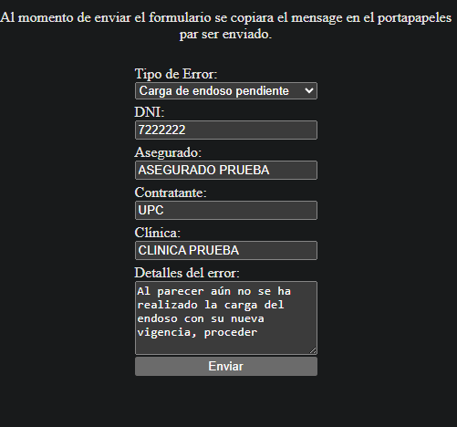
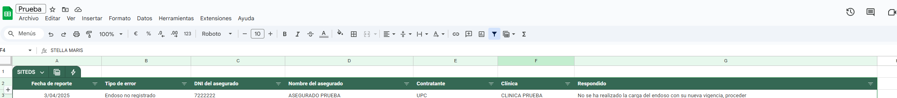
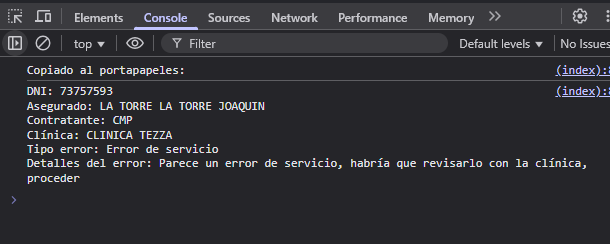

### Crear los siguentes archivos en la raíz del proyecto
- incidentes.csv
- incidentes_res.txt

## Preview


## Archivo Google Sheets


## Historial de mensajes 
Cada vez que se registre un incidente, se imprime un mensaje en la consola del navegador.




## Instalación local
```bash
git clone https://github.com/jackmmd/mg
```
```bash
cd mg
```
```bash
npm i
```
```bash
npm run dev
```
```bash
http://localhost:3000
```