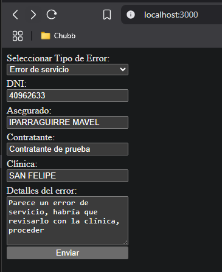
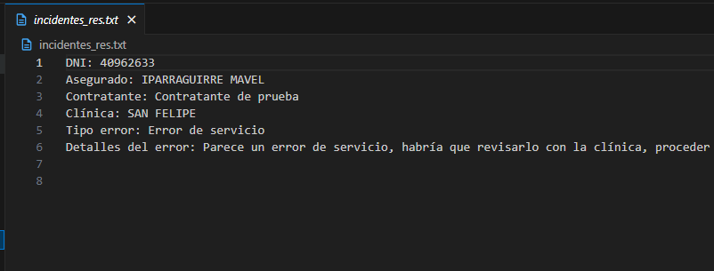
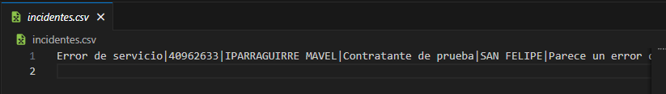

### Crear los siguentes archivos en la raíz del proyecto
- incidentes.csv
- incidentes_res.txt

## Preview


## Archivo incidentes.csv


## Archivo incidentes_res.txt



## Ejecución del script
```bash
npm run dev
```

```bash
http://localhost:3000
```